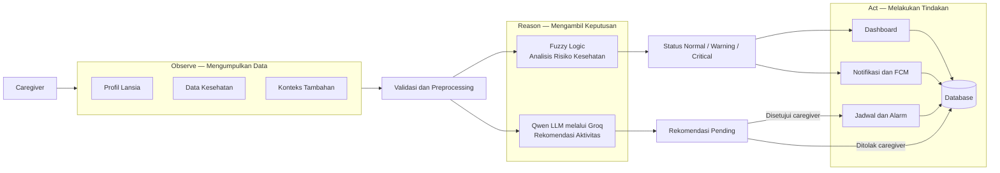
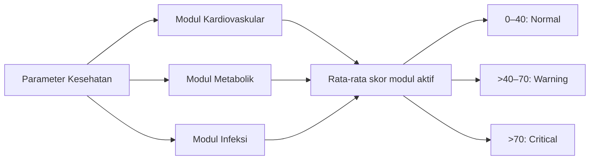
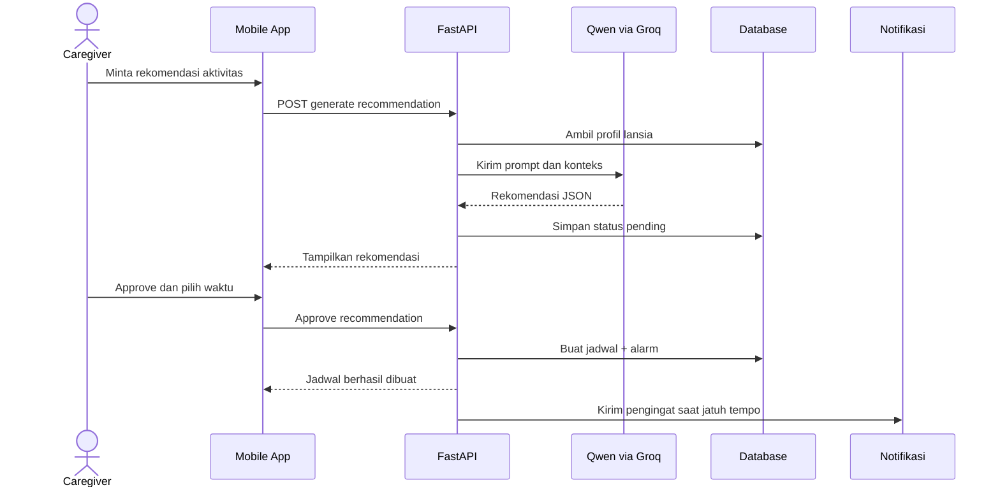

# Penjelasan UAS PSC 2 — Smart Caregiver

## 1. Gambaran Singkat Produk

**Smart Caregiver** adalah aplikasi yang membantu caregiver memantau kesehatan lansia, menerima peringatan kondisi berisiko, memperoleh rekomendasi aktivitas dari AI, dan mengatur jadwal kegiatan lansia.

Sistem menggunakan pendekatan **hybrid AI**, yaitu:

1. **Fuzzy logic** untuk menilai data kesehatan secara terukur.
2. **Large Language Model (LLM)** untuk membuat rekomendasi aktivitas yang personal.
3. **Human-in-the-loop** agar rekomendasi AI tetap harus disetujui atau ditolak oleh caregiver.

> **Catatan istilah:** proyek ini menggunakan **Groq**, bukan Grok. Groq adalah layanan untuk menjalankan model LLM dengan cepat. Model yang digunakan pada kode saat ini adalah `qwen/qwen3-32b`. Grok adalah model AI berbeda yang dibuat oleh xAI.

## 2. Alur Utama Sistem



Versi singkatnya:

> **Data masuk → data divalidasi → fuzzy logic dan LLM melakukan analisis → caregiver menerima hasil → sistem menjalankan tindakan.**

---

## 3. Observe — Perception (30%)

### Apa yang diamati sistem?

Pada Smart Caregiver, proses _observe_ tidak menggunakan kamera, MediaPipe, atau YOLO. Persepsi sistem berasal dari **data terstruktur** yang dimasukkan caregiver.

Data kesehatan yang diamati antara lain:

- Tekanan darah sistolik dan diastolik.
- Detak jantung.
- Kadar oksigen atau SpO2.
- Gula darah.
- Kolesterol.
- Asam urat.
- Berat badan.
- Suhu tubuh.
- Catatan harian dan keluhan.

Data konteks untuk LLM meliputi:

- Nama dan usia lansia.
- Tingkat mobilitas.
- Hobi dan minat.
- Riwayat medis.
- Kondisi fisik.
- Konteks tambahan dari caregiver.

### Bagaimana preprocessing dilakukan?

Sebelum data digunakan untuk mengambil keputusan:

1. **Pydantic** memvalidasi tipe dan format data dari API.
2. Sistem memilih modul fuzzy berdasarkan parameter yang tersedia.
3. Teks profil dibersihkan dari karakter tag seperti `<` dan `>`.
4. Panjang teks dibatasi untuk mencegah input terlalu besar.
5. Data pasien ditempatkan di dalam bagian `<data_pasien>` dan ditegaskan hanya sebagai konteks, bukan instruksi.

### Pembagian pengamatan fuzzy

| Modul          | Data yang diamati                              | Syarat modul dijalankan    |
| -------------- | ---------------------------------------------- | -------------------------- |
| Kardiovaskular | Tekanan darah, detak jantung, SpO2             | Ketiga data tersedia       |
| Metabolik      | Gula darah, kolesterol, asam urat, berat badan | Minimal satu data tersedia |
| Infeksi        | Suhu tubuh dan SpO2                            | Kedua data tersedia        |

### Nilai utama untuk presentasi

- Sistem tidak langsung mengirim input mentah ke AI.
- Data divalidasi dan dibersihkan terlebih dahulu.
- Informasi yang relevan dipilih sesuai kebutuhan analisis.
- Semakin lengkap dan benar data masukan, semakin baik hasil fuzzy maupun rekomendasi LLM.

> **Kalimat presentasi:** “Observe pada aplikasi kami adalah proses menangkap kondisi lansia melalui data kesehatan dan profil. Data tersebut divalidasi serta diproses sebelum dipakai oleh fuzzy logic dan LLM.”

---

## 4. Reason — Decision Making (30%)

Smart Caregiver memiliki dua mekanisme penalaran yang saling melengkapi.

### A. Penalaran fuzzy logic

Fuzzy logic digunakan untuk mengubah angka kesehatan menjadi tingkat risiko yang mudah dipahami.



Skor akhir adalah rata-rata dari semua modul yang aktif:

```text
skor akhir = jumlah skor modul aktif / jumlah modul aktif
```

Fuzzy logic cocok untuk penilaian kesehatan karena batas antar-kondisi tidak selalu benar-benar kaku. Selain hasil fuzzy, sistem juga dapat membandingkan data dengan ambang kesehatan khusus milik lansia. Status dengan prioritas tertinggi yang digunakan.

### B. Penalaran LLM melalui Groq

LLM digunakan untuk menghasilkan satu rekomendasi aktivitas berdasarkan profil setiap lansia.

Implementasi AI:

| Bagian              | Implementasi          |
| ------------------- | --------------------- |
| Penyedia inference  | Groq API              |
| Model               | `qwen/qwen3-32b`      |
| Format API          | OpenAI-compatible API |
| Temperature         | `0.7`                 |
| Batas output        | `500` token           |
| Output yang diminta | JSON terstruktur      |
| Versi prompt        | `v1`                  |

### Prompt engineering yang digunakan

Prompt memberikan peran kepada LLM sebagai **asisten perawatan lansia** dan menyertakan konteks yang relevan. LLM diperintahkan untuk:

1. Menyesuaikan aktivitas dengan tingkat mobilitas.
2. Memperhatikan kontraindikasi dari riwayat medis.
3. Mempertimbangkan hobi dan minat lansia.
4. Memberikan nama, kategori, deskripsi, durasi, frekuensi, dan alasan.
5. Mengembalikan hasil hanya dalam format JSON.

Contoh bentuk hasil yang diharapkan:

```json
{
  "activity": "Senam ringan sambil duduk",
  "category": "physical",
  "description": "Gerakan ringan yang dapat dilakukan dari kursi.",
  "duration_minutes": 20,
  "frequency": "3x per minggu",
  "reasoning": "Sesuai untuk mobilitas terbatas dan membantu menjaga kebugaran."
}
```

### Pengamanan dan interpretasi output

- Input teks dibersihkan untuk mengurangi risiko _prompt injection_.
- Prompt memisahkan instruksi sistem dan data pasien.
- Bagian `<think>...</think>` dibuang jika muncul pada jawaban model.
- JSON diekstrak dan dipetakan ke struktur data aplikasi.
- Jika JSON tidak berhasil dibaca, sistem memiliki nilai bawaan dan mekanisme _fallback_.
- Nama model dan versi prompt disimpan bersama rekomendasi agar hasil dapat dilacak.

### Human-in-the-loop

Hasil LLM tidak langsung dijalankan. Rekomendasi pertama kali berstatus `pending`, kemudian caregiver dapat:

- **Approve**: menerima rekomendasi dan memilih waktu pelaksanaan.
- **Reject**: menolak rekomendasi dan memberikan alasan.

Pendekatan ini penting karena AI berfungsi sebagai **pendukung keputusan**, bukan pengganti keputusan caregiver atau tenaga medis.

> **Kalimat presentasi:** “Fuzzy logic menjawab seberapa berisiko kondisi kesehatan, sedangkan LLM menjawab aktivitas apa yang paling sesuai berdasarkan konteks lansia. Keputusan akhir tetap berada pada caregiver.”

---

## 5. Act — Action and Goal Achievement (20%)

Hasil analisis tidak berhenti sebagai teks. Sistem mengubah hasil tersebut menjadi tindakan nyata.

| Hasil sistem                       | Tindakan                                                      |
| ---------------------------------- | ------------------------------------------------------------- |
| Data kesehatan baru                | Disimpan ke database dan ditampilkan pada riwayat kesehatan   |
| Kondisi normal                     | Membuat notifikasi pencatatan kesehatan                       |
| Kondisi berisiko/kritis            | Membuat peringatan prioritas tinggi dan push notification FCM |
| Rekomendasi LLM dibuat             | Disimpan dengan status `pending` untuk ditinjau caregiver     |
| Rekomendasi disetujui dengan waktu | Otomatis membuat jadwal dengan sumber `ai_approved`           |
| Jadwal memiliki pengingat          | Membuat alarm sesuai menit pengingat                          |
| Alarm telah jatuh tempo            | Membuat notifikasi pengingat kepada caregiver                 |
| Data kesehatan berkala             | Ditampilkan sebagai ringkasan dan tren pada dashboard         |

### Alur rekomendasi hingga menjadi aksi



### Tentang tool calling

Implementasi saat ini **belum memakai native LLM tool calling/function calling**. LLM bertugas menghasilkan rekomendasi terstruktur, sedangkan aksi dilakukan oleh service FastAPI setelah caregiver menekan _approve_. Secara arsitektur, ini lebih aman karena LLM tidak dapat langsung mengubah jadwal tanpa persetujuan manusia.

> **Kalimat presentasi:** “Act terlihat ketika output AI yang disetujui otomatis menjadi jadwal dan alarm. Hasil analisis kesehatan juga dapat memicu dashboard serta notifikasi prioritas tinggi.”

---

## 6. Build — Engineering and Presentation (20%)

### Struktur teknologi

| Lapisan         | Teknologi                         | Tanggung jawab                                                             |
| --------------- | --------------------------------- | -------------------------------------------------------------------------- |
| Mobile          | Flutter + GetX                    | UI, state management, navigasi, dan komunikasi API                         |
| Backend         | FastAPI                           | Endpoint, autentikasi, validasi, dan business logic                        |
| AI              | Qwen melalui Groq                 | Membuat rekomendasi aktivitas personal                                     |
| Decision engine | Fuzzy logic                       | Menghitung risiko kondisi kesehatan                                        |
| Database        | PostgreSQL + SQLAlchemy async     | Menyimpan pengguna, profil, kesehatan, rekomendasi, jadwal, dan notifikasi |
| Migration       | Alembic                           | Mengelola perubahan struktur database                                      |
| Notification    | In-app + Firebase Cloud Messaging | Mengirim informasi dan peringatan ke caregiver                             |

### Modularitas backend

Backend dipisahkan berdasarkan tanggung jawab:

```text
server/src/
├── app/routers/       # Endpoint API
├── app/schemas/       # Validasi request dan response
├── app/services/      # Business logic
├── app/core/fuzzy/    # Mesin fuzzy
├── app/core/          # Auth, keamanan, scheduler, FCM
└── database/models/   # Model database
```

### Modularitas mobile

Aplikasi Flutter menggunakan pola GetX:

```text
mobile/lib/app/
├── data/              # API, model, dan repository
├── modules/           # View, controller, dan binding per fitur
├── routes/            # Daftar dan navigasi halaman
└── core/              # Konfigurasi, tema, validator, dan FCM
```

Fitur mobile meliputi dashboard, log kesehatan, rekomendasi AI, jadwal, kalender, profil lansia, dan notifikasi.

### Kualitas engineering

- Operasi database menggunakan pola asynchronous.
- Analisis fuzzy yang bersifat CPU-bound dijalankan pada thread pool agar tidak memblokir API.
- JWT digunakan untuk autentikasi.
- Data setiap lansia hanya dapat diakses oleh caregiver pemiliknya.
- API memakai schema request/response agar format data konsisten.
- Konfigurasi sensitif seperti `GROQ_API_KEY` disimpan melalui environment variable.
- Endpoint internal untuk alarm dan ringkasan dilindungi dengan `INTERNAL_API_KEY`.
- Dokumentasi API tersedia melalui Swagger/OpenAPI FastAPI.

> **Kalimat presentasi:** “Build kami memisahkan UI, API, business logic, AI, dan database agar kode mudah dikembangkan, diuji, dan dipelihara.”

---

## 7. Hubungan Sistem dengan Bobot Penilaian

| Komponen    |  Bobot   | Bukti pada Smart Caregiver                                                                                   |
| ----------- | :------: | ------------------------------------------------------------------------------------------------------------ |
| **Observe** | **30%**  | Input kesehatan dan profil, validasi Pydantic, pemilihan data, serta sanitasi konteks LLM                    |
| **Reason**  | **30%**  | Tiga modul fuzzy, agregasi skor, prompt engineering, penggunaan konteks, parsing JSON, dan human-in-the-loop |
| **Act**     | **20%**  | Dashboard, REST API, database, notifikasi FCM, approval AI, pembuatan jadwal, dan alarm otomatis             |
| **Build**   | **20%**  | FastAPI modular, Flutter GetX, async database, autentikasi, dokumentasi, UI, pengujian, dan demo             |
| **Total**   | **100%** | Siklus lengkap dari data hingga tindakan nyata                                                               |

---

## 8. Saran Urutan Presentasi

### Pembukaan

> “Smart Caregiver membantu caregiver memantau kesehatan lansia dan mendapatkan rekomendasi aktivitas personal. Sistem kami menggabungkan fuzzy logic untuk analisis kesehatan dengan model Qwen yang dijalankan melalui Groq untuk rekomendasi aktivitas.”

### Urutan penjelasan

1. Jelaskan masalah yang diselesaikan aplikasi.
2. Tampilkan diagram Observe–Reason–Act.
3. Masukkan satu data kesehatan dan tunjukkan hasil fuzzy.
4. Jelaskan tiga modul fuzzy dan status akhirnya.
5. Tampilkan profil lansia lalu generate rekomendasi AI.
6. Tunjukkan alasan rekomendasi dari LLM.
7. Approve rekomendasi dan tunjukkan jadwal yang otomatis terbentuk.
8. Tampilkan dashboard dan notifikasi.
9. Tutup dengan struktur engineering dan pembagian bobot.

### Penutup

> “Kekuatan utama sistem kami adalah alur yang lengkap. Sistem tidak hanya mengamati dan memberikan hasil AI, tetapi juga membantu caregiver mengambil tindakan melalui peringatan, rekomendasi, jadwal, dan pengingat.”

---

## 9. Checklist Demo

- [ ] Login sebagai caregiver.
- [ ] Tampilkan profil lansia dan data konteksnya.
- [ ] Catat data kesehatan normal.
- [ ] Catat data kesehatan berisiko untuk menunjukkan fuzzy dan critical alert.
- [ ] Tampilkan perubahan pada dashboard dan riwayat kesehatan.
- [ ] Generate rekomendasi aktivitas AI.
- [ ] Jelaskan isi rekomendasi dan alasan dari LLM.
- [ ] Approve rekomendasi dengan tanggal serta pengingat.
- [ ] Tampilkan jadwal yang dibuat dari rekomendasi AI.
- [ ] Tampilkan notifikasi aplikasi.
- [ ] Siapkan hasil rekomendasi yang sudah tersimpan jika koneksi Groq bermasalah.

## 10. Pertanyaan yang Mungkin Ditanyakan Penguji

### “Apakah kalian menggunakan Grok?”

Tidak. Kami menggunakan **Groq sebagai penyedia inference** dan **Qwen sebagai model LLM**.

### “Mengapa memakai fuzzy logic dan LLM sekaligus?”

Fuzzy logic memberikan hasil kesehatan yang terukur dan konsisten, sedangkan LLM memahami konteks profil untuk membuat rekomendasi aktivitas yang lebih personal.

### “Apakah AI dapat langsung membuat jadwal?”

Tidak langsung. Rekomendasi berstatus `pending` dan harus disetujui caregiver. Setelah disetujui, backend otomatis membuat jadwal dan alarm.

### “Bagaimana jika format jawaban LLM tidak sesuai?”

Sistem mencoba mengekstrak JSON, membersihkan bagian yang tidak diperlukan, dan menyediakan mekanisme fallback agar aplikasi tidak langsung gagal karena format keluaran.

### “Apakah rekomendasi AI merupakan diagnosis medis?”

Tidak. AI hanya memberikan rekomendasi aktivitas sebagai pendukung keputusan. Keputusan akhir tetap pada caregiver dan masalah medis harus dikonsultasikan kepada tenaga kesehatan.

### “Bagaimana keamanan datanya?”

API menggunakan JWT, validasi kepemilikan data, sanitasi input, environment variable untuk secret, dan persetujuan caregiver sebelum rekomendasi AI menjadi tindakan.

---

## 11. Referensi Implementasi

- Layanan rekomendasi LLM: [`server/src/app/services/recommendation_service.py`](server/src/app/services/recommendation_service.py)
- Mesin fuzzy: [`server/src/app/core/fuzzy/engine.py`](server/src/app/core/fuzzy/engine.py)
- Layanan kesehatan: [`server/src/app/services/health_service.py`](server/src/app/services/health_service.py)
- Layanan jadwal: [`server/src/app/services/schedule_service.py`](server/src/app/services/schedule_service.py)
- Layanan notifikasi: [`server/src/app/services/notification_service.py`](server/src/app/services/notification_service.py)
- Halaman rekomendasi mobile: [`mobile/lib/app/modules/rekomendasi_ai/`](mobile/lib/app/modules/rekomendasi_ai/)
- Dokumen kebutuhan produk: [`docs/prd.md`](docs/prd.md)
