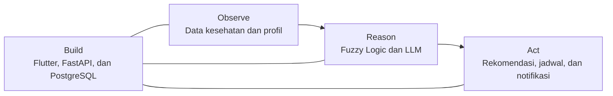

# Penilaian UAS PSC 2 — Smart Caregiver

## Ringkasan Penilaian Produk dengan LLM Agent

| Komponen | Implementasi pada Smart Caregiver |
| --- | --- |
| **Observe (Perception) — 30%** | Sistem mengamati data kesehatan dan profil lansia. Data kesehatan mencakup tekanan darah, detak jantung, SpO2, gula darah, kolesterol, asam urat, berat badan, dan suhu tubuh. Konteks LLM mencakup usia, mobilitas, hobi, riwayat medis, kondisi fisik, dan konteks tambahan dari caregiver. Data divalidasi dan dibersihkan sebelum dianalisis. |
| **Reason (Decision Making) — 30%** | Sistem menggunakan LLM `qwen/qwen3-32b` melalui Groq untuk membuat rekomendasi aktivitas yang sesuai dengan kondisi lansia. Prompt mengatur peran AI, memberikan konteks pasien, menetapkan aturan keselamatan, dan meminta output JSON. Fuzzy logic digunakan sebagai pendukung untuk menilai risiko kesehatan melalui modul kardiovaskular, metabolik, dan infeksi. |
| **Act (Action & Goal Achievement) — 20%** | Hasil LLM disimpan sebagai rekomendasi berstatus `pending`. Caregiver dapat menyetujui atau menolak rekomendasi. Rekomendasi yang disetujui dapat otomatis menjadi jadwal dan alarm. Hasil analisis kesehatan juga diteruskan ke dashboard, database, notifikasi aplikasi, dan push notification FCM. |
| **Build (Engineering & Presentation) — 20%** | Aplikasi dibangun dengan Flutter dan GetX pada sisi mobile, FastAPI pada backend, PostgreSQL dan SQLAlchemy untuk database, serta Groq API untuk akses LLM. Kode dipisahkan menjadi router, schema, service, model, repository, controller, binding, dan view agar modular dan mudah dipelihara. |
| **Total — 100%** | Sistem menjalankan alur lengkap dari pengumpulan data, penalaran AI, hingga tindakan nyata untuk membantu caregiver. |

## Drill Down

### 1. Observe — Perception (30%)

Pada Smart Caregiver, proses *observe* dilakukan melalui data terstruktur, bukan kamera atau deteksi objek. Caregiver memasukkan data kesehatan dan profil lansia melalui aplikasi Flutter. Backend FastAPI memvalidasi tipe, format, dan kelengkapan data menggunakan schema Pydantic. Untuk kebutuhan LLM, teks profil dibersihkan dari karakter tag dan dibatasi panjangnya untuk mengurangi risiko *prompt injection* dan penggunaan token berlebihan. Hasil tahap ini adalah konteks yang bersih dan relevan untuk proses penalaran.

### 2. Reason — Decision Making (30%)

Penalaran utama untuk rekomendasi aktivitas menggunakan model `qwen/qwen3-32b` yang dijalankan melalui Groq. Groq adalah penyedia layanan *inference*, sedangkan Qwen adalah model LLM yang menghasilkan rekomendasi. Prompt menempatkan AI sebagai asisten perawatan lansia, menyertakan usia, mobilitas, hobi, riwayat medis, dan kondisi fisik, lalu memerintahkan AI agar memilih aktivitas yang aman serta mengembalikan nama aktivitas, kategori, deskripsi, durasi, frekuensi, dan alasan dalam format JSON.

Selain LLM, sistem menggunakan fuzzy logic untuk menilai kondisi kesehatan. Modul kardiovaskular menganalisis tekanan darah, detak jantung, dan SpO2; modul metabolik menganalisis gula darah, kolesterol, asam urat, dan berat badan; sedangkan modul infeksi menganalisis suhu tubuh dan SpO2. Skor modul aktif dirata-ratakan menjadi status akhir `Normal`, `Warning`, atau `Critical`. Fuzzy logic memberikan keputusan kesehatan yang terukur, sedangkan LLM memberikan rekomendasi yang personal berdasarkan konteks lansia.

### 3. Act — Action and Goal Achievement (20%)

Output LLM tidak langsung dijalankan. Rekomendasi disimpan ke database dengan status `pending` agar caregiver tetap menjadi pengambil keputusan akhir. Jika rekomendasi disetujui dan waktu pelaksanaan dipilih, backend otomatis membuat jadwal dengan sumber `ai_approved` serta membuat alarm sesuai waktu pengingat. Jika kondisi kesehatan berisiko, sistem membuat notifikasi prioritas tinggi dan mengirimkan push notification melalui FCM. Hasil lain juga ditampilkan pada dashboard, riwayat kesehatan, rekomendasi AI, jadwal, dan halaman notifikasi.

Implementasi saat ini tidak menggunakan native LLM *tool calling*. LLM hanya menghasilkan rekomendasi terstruktur, sedangkan tindakan dilakukan oleh service FastAPI setelah caregiver memberikan persetujuan. Alur ini mencegah AI mengubah jadwal secara langsung tanpa kontrol manusia.

### 4. Build — Engineering and Presentation (20%)

Sisi mobile menggunakan Flutter dengan GetX untuk state management, dependency injection, dan navigasi. Sisi backend menggunakan FastAPI dengan pemisahan router untuk endpoint, schema untuk validasi, service untuk business logic, dan model untuk database. PostgreSQL menyimpan profil lansia, data kesehatan, hasil fuzzy, rekomendasi AI, jadwal, alarm, serta notifikasi. Operasi database berjalan secara asynchronous, analisis fuzzy dijalankan melalui thread pool agar tidak memblokir API, dan autentikasi menggunakan JWT serta pemeriksaan kepemilikan data caregiver.

## Kesimpulan

Smart Caregiver memenuhi alur **Observe → Reason → Act** dengan fondasi **Build** yang modular. Sistem mengamati data kesehatan dan profil lansia, menggunakan fuzzy logic dan LLM untuk mengambil keputusan, lalu mengubah hasilnya menjadi rekomendasi, jadwal, dashboard, dan notifikasi yang dapat digunakan caregiver.
